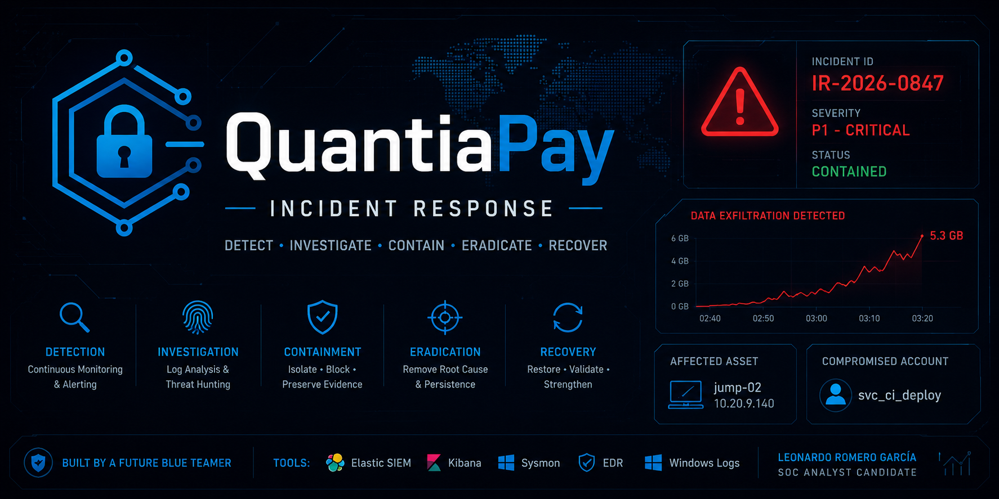

# QuantiaPay Incident Response
### A Blue Team simulation by Leonardo Romero Garcia

> A full Incident Response investigation covering credential compromise, lateral movement, and data exfiltration — documented end-to-end as a real SOC analyst would.

---

## Why This Project

This simulation put me in the role of a SOC analyst responding to a live P1 incident. No guided steps. No hints. Just logs, alerts, and decisions under pressure.

The goal was to go beyond theory and actually practice:

| Skill | What I Did |
|-------|-----------|
| Log triage | Separated normal system activity from malicious events in real time |
| Containment | Isolated a compromised host via EDR without touching production |
| Evidence collection | Captured 5 volatile sources in correct forensic order |
| Eradication | Identified and removed 2 persistence mechanisms |
| Recovery | Determined rebuild strategy for a compromised jump host |
| Reporting | Generated a full incident report from a live event |

---

## What I Learned

Working through this incident taught me things I couldn't get from reading:

**Containment is surgical, not blunt.** Blocking a single `/32` host-to-IP rule stopped the exfiltration without touching a single production route. Over-containing is its own failure mode.

**Volatility order matters more than speed.** RAM had to come before isolation. The `temp.conf` inside `rclone.exe`'s memory — the file that proved where the data went — would have been gone on shutdown.

**Normal logs will distract you.** The 02:47 and 02:51 events looked suspicious at first glance. Correctly identifying them as legitimate baseline activity — and not flagging them — was as important as catching the real breakpoint at 03:02.

**Persistence is never just one mechanism.** Removing `OneDriveSync` wasn't enough. `WindowsUpdateCheck` reactivated the attacker before I caught it. A clean host means a full sweep, not a partial one.

**Reporting happens during the incident, not after.** Documenting decisions in real time — why EDR over shutdown, why `/32` over subnet — is what separates a professional response from a lucky one.

---

## Incident at a Glance

| Field | Value |
|-------|-------|
| Incident ID | IR-2026-0847 |
| Organization | QuantiaPay |
| Severity | P1 — Critical |
| Compromised Account | `svc_ci_deploy` |
| Affected Host | `jump-02` (10.20.9.140) |
| Attacker IP | `198.51.100.23` |
| Data Exfiltrated | 5.3 GB |
| Root Cause | Service account token exposed in CI/CD build log |
| Production Disruption | None |
| Final Score | **99 / 100** |

---

## Attack Summary

```
02:47  ─── Legitimate CI/CD login (baseline)
02:51  ─── Pipeline #4471 deployed to production
           │
03:02  ─── ⚠ BREAKPOINT — svc_ci_deploy → jump-02 [ANOMALOUS]
03:03  ─── AD enumeration via LDAP
03:05  ─── Encoded PowerShell via WinRM
03:06  ─── net group "Domain Admins" /domain
           │
03:09  ─── 🔴 rclone.exe → 198.51.100.23:443
03:11  ─── 🔴 1.2 GB exfiltrated
03:14  ─── 🚨 SIEM P1 alert fires
03:15  ─── 🔴 3.8 GB cumulative — ACTIVE
           │
03:12  ─── ✅ EDR isolation · jump-02 contained
03:12  ─── ✅ Firewall /32 rule · exfil blocked
           └── Total exfiltrated: 5.3 GB
```

---

## Response Phases

| Phase | Action | Score |
|-------|--------|-------|
| Triage & Declaration | Breakpoint identified at 03:02:15 · Incident declared | 100/100 |
| Containment | EDR isolation + surgical `/32` firewall rule | 100/100 |
| Evidence Collection | 5/5 sources captured in volatility order | 100/100 |
| Eradication | 2 persistence mechanisms removed · credentials rotated | 95/100 |
| Verification | 6/6 post-eradication checkpoints passed | 100/100 |

---

## MITRE ATT&CK Coverage

| Tactic | Technique | ID |
|--------|-----------|-----|
| Initial Access | Valid Accounts: Service Accounts | T1078.003 |
| Lateral Movement | Remote Services: WinRM | T1021.006 |
| Discovery | Remote System Discovery | T1018 |
| Discovery | Domain Account Discovery | T1087.002 |
| Execution | PowerShell | T1059.001 |
| Defense Evasion | Obfuscated Files or Information | T1027 |
| Exfiltration | Exfiltration Over C2 Channel | T1041 |
| Persistence | Scheduled Task | T1053.005 |
| Persistence | Registry Run Keys | T1547.001 |

---

## Repository Structure

| Folder | Contents |
|--------|----------|
| [`docs/`](./docs/) | Phase-by-phase documentation — declaration through post-incident review |
| [`evidence/`](./evidence/) | Forensic evidence collected during the investigation |
| [`iocs/`](./iocs/) | Indicators of Compromise and detection rules |
| [`timeline/`](./timeline/) | Attack timeline and analyst response timeline |
| [`images/`](./images/) | Screenshots from the IR Console simulation |

---

## Technologies

| Tool | Role |
|------|------|
| Elastic / Kibana | SIEM — log correlation and alerting |
| Sysmon | Endpoint telemetry |
| Windows Event Logs | Authentication and execution logging |
| PowerShell | Attack vector and analysis tool |
| MITRE ATT&CK | TTP mapping and detection guidance |

---

*Leonardo Romero Garcia · Blue Team · 2026*
