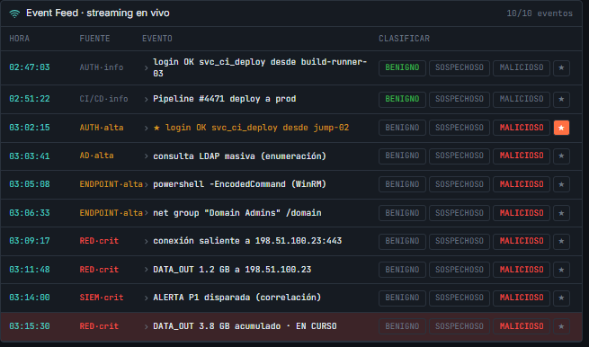

# Images
### Incident IR-2026-0847 · QuantiaPay

> Screenshots captured from the IR Console during the live simulation.
> Replace each `image.png` placeholder with your actual screenshot.

---

## 01 — SIEM P1 Alert

> The correlation rule fires at 03:14:00 — anomalous service account activity combined with active external exfiltration.

---

## 02 — Netstat Output (rclone.exe)

> Live network connection showing `rclone.exe` (PID 4188) actively connected to `198.51.100.23:443` at time of capture.

---

## 03 — RAM Capture

> 16 GB memory image secured from `jump-02`. Contains `rclone.exe` in memory and `temp.conf` with the exfiltration destination.

---

## 04 — Verify All (6/6 OK)

> All six post-eradication checkpoints confirmed clean.

---

## 05 — Final Score

> Session score: 99/100 across all five response phases.

---

*Last updated: 2026-07-18 · Incident IR-2026-0847*
