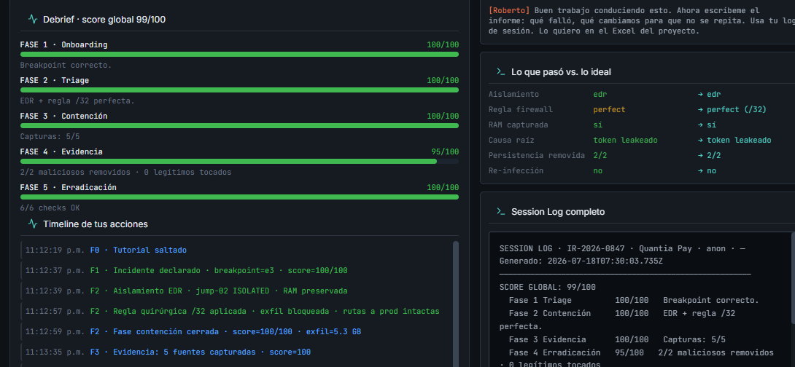
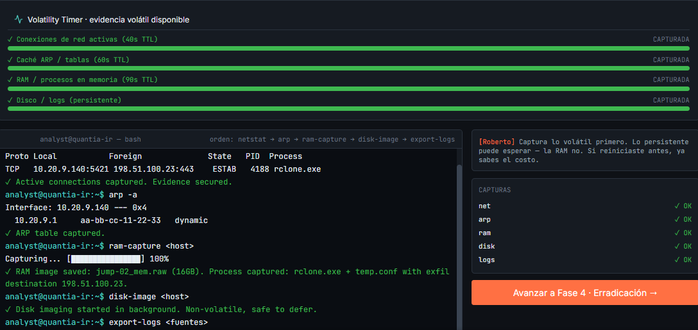
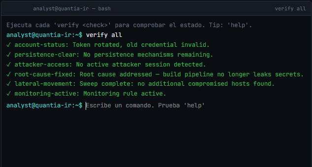

# QuantiaPay Incident Response
> Investigation and response to a simulated cybersecurity incident involving credential compromise, lateral movement, and data exfiltration within the QuantiaPay environment.

---

## Final Score



---

## Overview

This repository documents a complete Incident Response investigation performed during a simulated enterprise security scenario.

The investigation covers the full incident lifecycle:

- **Detection** — SIEM P1 alert triggered at 03:14 AM via correlation rule
- **Triage** — Breakpoint identified at 03:02:15, incident declared as IR-2026-0847
- **Containment** — EDR isolation + surgical `/32` firewall rule, zero production impact
- **Evidence Collection** — 5 volatile sources captured in correct volatility order
- **Eradication** — 2 persistence mechanisms removed, credentials rotated, root cause fixed
- **Recovery** — `jump-02` scheduled for rebuild from trusted image (RTO: 2 hours)
- **Post-Incident Review** — Control gap matrix and 3 prioritized recommendations

---

## Scenario

The Security Operations Center (SOC) detected suspicious activity involving the service account **svc_ci_deploy**.

At **03:02:15 AM**, the account — normally used exclusively by the CI/CD pipeline — authenticated interactively to **jump-02**, an administrative host with no prior association to the account. The attacker then performed Active Directory enumeration, executed encoded PowerShell commands via WinRM, and opened an outbound HTTPS connection to **198.51.100.23**, exfiltrating **5.3 GB** of data before containment.

The root cause: the account's authentication token was exposed in a public build log.

---

## Attack Timeline


```
02:47  Legitimate CI/CD login — svc_ci_deploy from build-runner-03
02:51  Pipeline #4471 deployed to production (approved)
       │
03:02  ⚠ BREAKPOINT — svc_ci_deploy logs into jump-02 [ANOMALOUS]
03:03  AD enumeration via mass LDAP query
03:05  Encoded PowerShell executed via WinRM
03:06  net group "Domain Admins" /domain
       │
03:09  🔴 rclone.exe connects to 198.51.100.23:443
03:11  🔴 Exfiltration: 1.2 GB
03:14  🚨 SIEM P1 alert fires — analyst notified
03:15  🔴 Exfiltration reaches 3.8 GB — ACTIVE
       │
03:12  ✅ EDR isolation applied (jump-02)
03:12  ✅ Firewall /32 rule blocks exfiltration
       └── Total exfiltrated: 5.3 GB
```

---

## Key Evidence




---

## Verification



---

## Skills Demonstrated

- Incident Response
- Digital Forensics
- Threat Analysis
- IOC Identification
- Security Monitoring
- Evidence Collection
- Documentation
- Blue Team Operations

---

## Technologies

- Elastic / Kibana
- Sysmon
- Windows Event Logs
- PowerShell
- Network Analysis
- MITRE ATT&CK Framework

---

## Repository Structure

```
docs/          Full phase-by-phase documentation (declaration → post-incident review)
evidence/      Forensic evidence collected during the investigation
images/        Screenshots from the IR Console simulation
iocs/          Indicators of Compromise and detection rules
timeline/      Attack timeline and analyst response timeline
```

---

## Disclaimer

This repository documents a fictional cybersecurity incident created for educational purposes.
No real systems, organizations, or sensitive information were involved.
